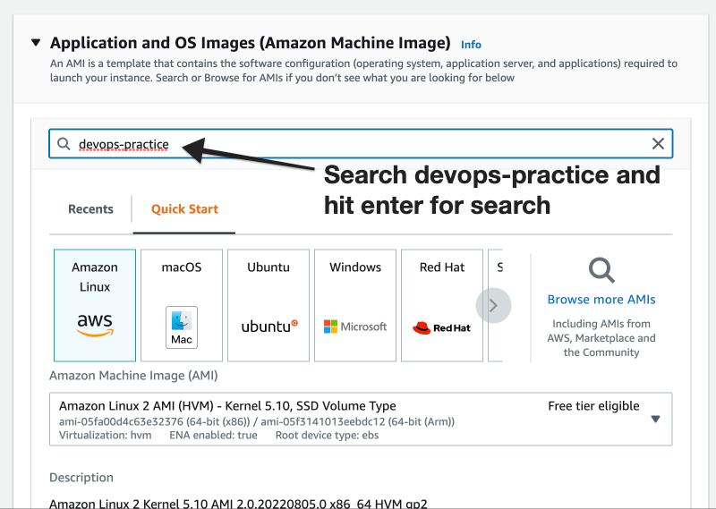
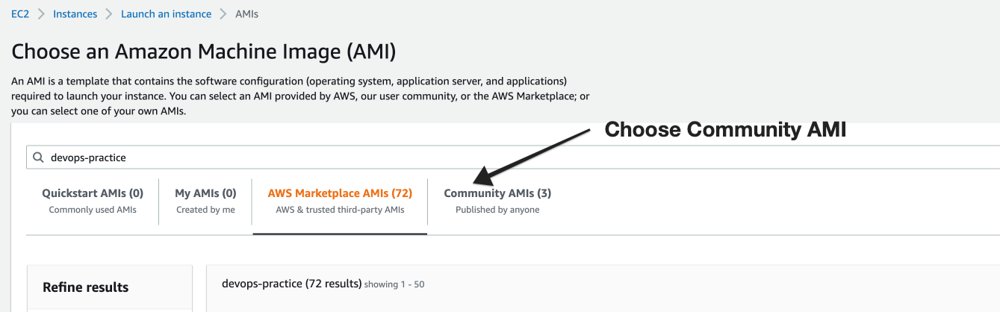
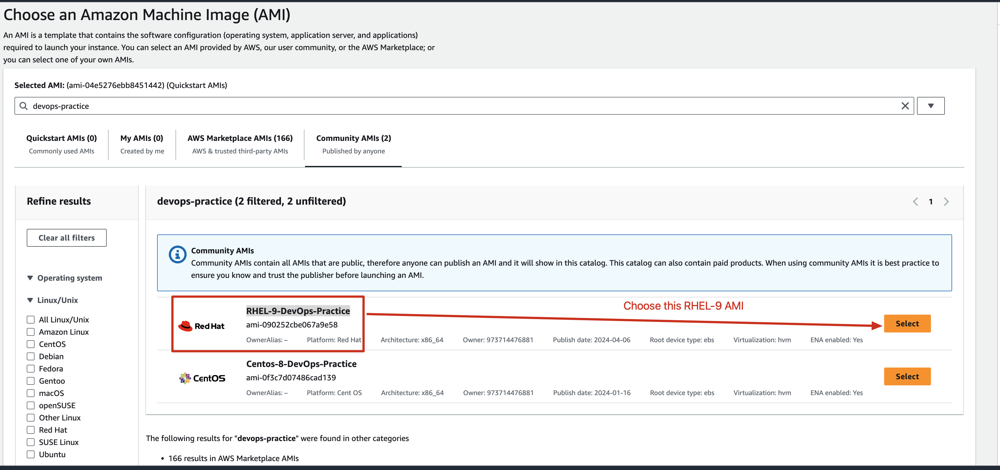
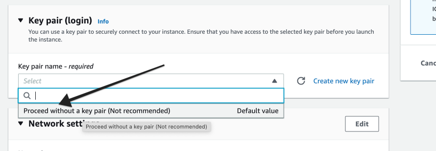
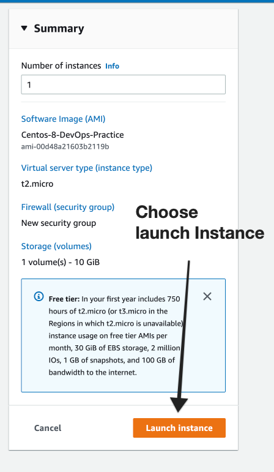

# How to Create a EC2 Server

1. Login to AWS Console with your email address and password.
[https://console.aws.amazon.com/](https://console.aws.amazon.com/)
2. Choose **N.Virginia** Region and Choose **EC2 service** to create a server. Then Choose **Instances**
Also, you can click the following link to choose region and service automatically.
[https://console.aws.amazon.com/ec2/v2/home?region=us-east-1#Instances:](https://console.aws.amazon.com/ec2/v2/home?region=us-east-1#Instances:)
3. Choose Launch Instance.
    
    
    

Once the instance is in the Running state then copy the IP address and connect to the server.

Username / Password : **centos / DevOps321**

# Video Reference:

The same above process is explained in the video format and here is the link.

 

[https://youtu.be/lUr3Pm2hNE0](https://youtu.be/lUr3Pm2hNE0)

# Additional Video Links

1. How to connect to an EC2 server from Windows Desktop Using Putty.

[https://youtu.be/qc4TaYMKf0c](https://youtu.be/qc4TaYMKf0c)

2. Best Options that Makes Putty more Productive.

[https://youtu.be/PGpKq6lWyB4](https://youtu.be/PGpKq6lWyB4)