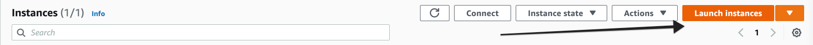
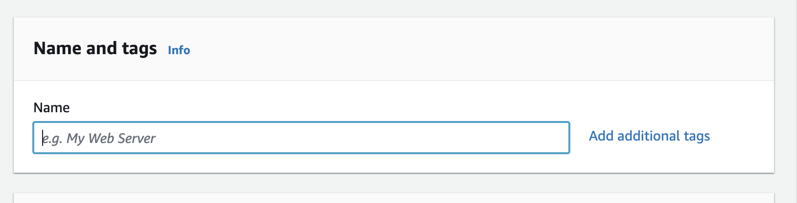
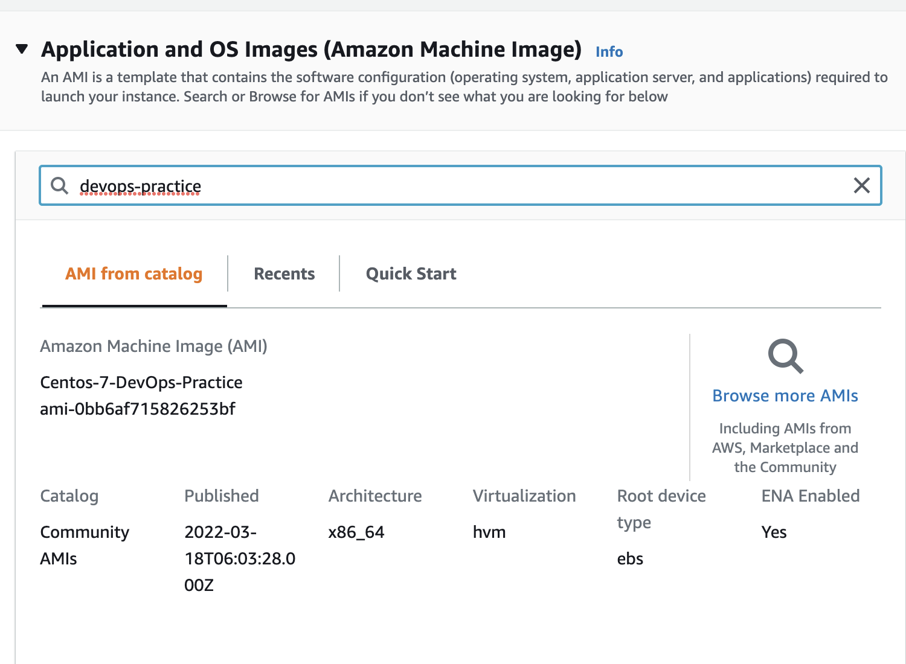
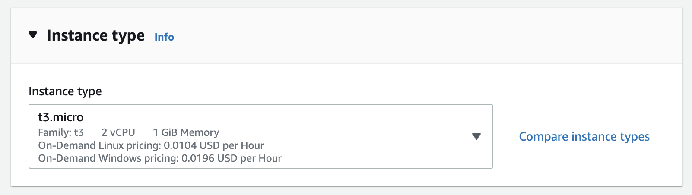
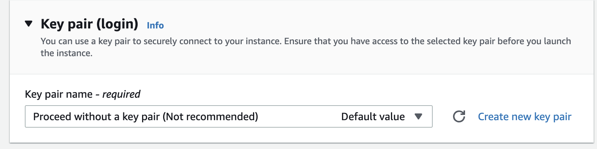
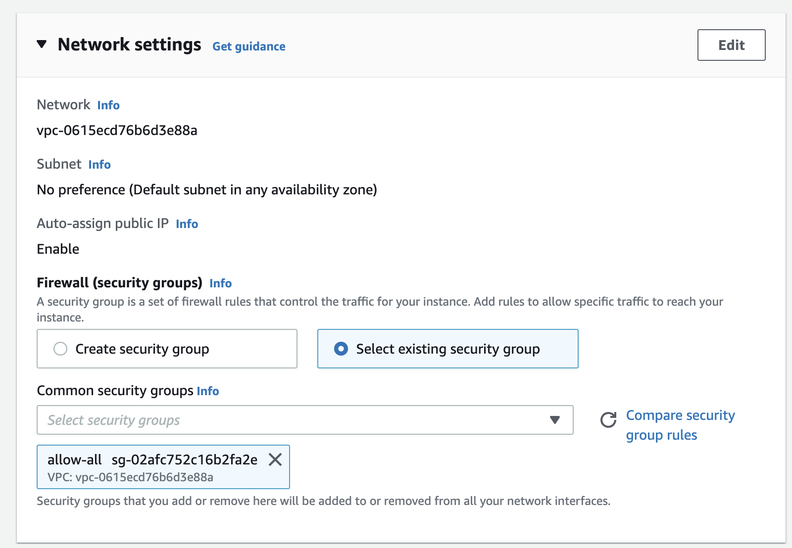
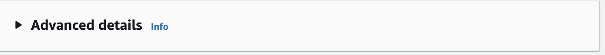
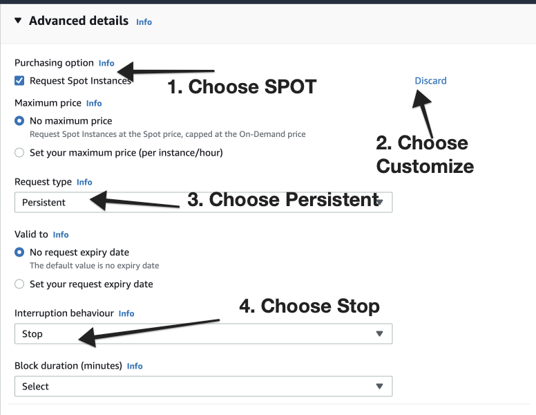

# How to Create a SPOT Instance

1. Choose **N.Virginia** Region and Choose **EC2 service** to create a server. Then Choose **Instances**
Also, you can click the following link to choose region and service automatically.
[https://console.aws.amazon.com/ec2/v2/home?region=us-east-1#Instances:](https://console.aws.amazon.com/ec2/v2/home?region=us-east-1#Instances:)
2. Choose Launch Instance.
    
    
    

1. Give the Name tag to the instance

1. Search for **devops-practice** and hit enter to search and choose the AMI from Community AMI’s

1. Choose Instance Type

1. Choose without keypair option.

1. Choose Security Group.

1. Go to Advanced Details.

